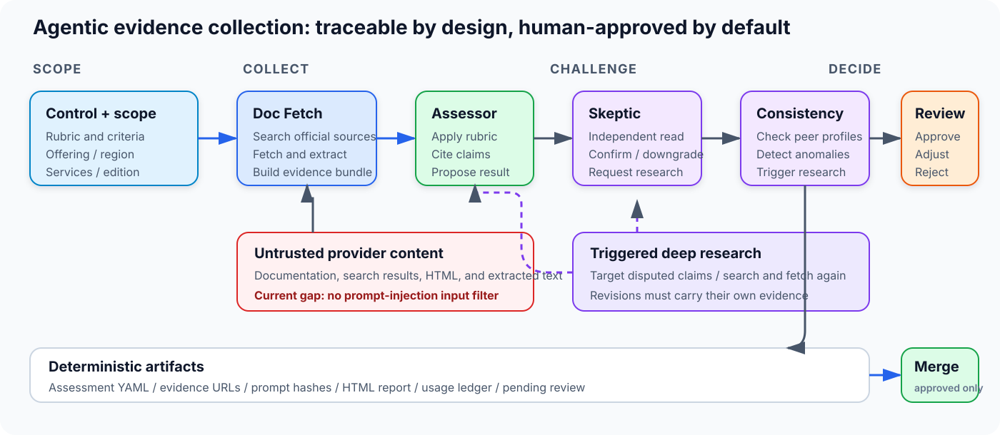

<!-- _paginate: false -->

# About me

## [PRESENTER-OWNED SLIDE]

- [Name, role, and relevant background]
- [Why I started tenant-sec]
- [One personal connection to the EU cloud problem]

<!--
Timing: 2 minutes.

This slide is intentionally left for the presenter.
End by explaining why you wanted a way to compare what cloud tenants can actually
configure and operate—not another catalogue of provider claims.
-->

---

<!-- _paginate: false -->

# tenant-sec

## Evidence before cloud claims

An open framework for comparing the security capabilities a cloud tenant can
**configure, enforce, verify, and operate**.

**Today:** the EU cloud dilemma → the methodology → the AI assessment pipeline → live inspection

> The goal is not to crown a “best cloud.” It is to make trade-offs inspectable.

<!--
Timing: 2 minutes.

Open with the promise:
- In 40 minutes, the audience should be able to distinguish cloud location,
  sovereignty, certification, and tenant-operable security.
- They will see both the assessment system and its current failure modes.
- Stress that tenant-sec is a decision aid, not a compliance opinion.
-->

---

# “Compliant” is too low-resolution

| What binary assurance says | What a tenant still needs to know |
|---|---|
| “Encryption is available” | Which services support my keys? Can I enforce it? |
| “Logging is supported” | Which control planes are covered? Can logs be locked? |
| “IAM exists” | Can policy override an accidental allow? |
| “Data stays in Europe” | Primary data only—or backups, metadata, and support paths too? |

Binary checks hide:

- **Maturity:** tenant-built automation and managed policy look identical
- **Coverage:** one supported service can mask gaps across the catalogue
- **Uncertainty:** missing documentation is easily misreported as absence

<!--
Timing: 4 minutes.

Use one concrete story: “CMK supported” can mean one storage product accepts a key,
while databases, AI, backups, or snapshots do not.

Explain the project's central shift:
- from “does a capability exist somewhere?”
- to “how operable is it, for this offering and these services?”

Do not imply that certifications are useless. They answer a different question.
-->

---

# Europe’s cloud dilemma is not one-dimensional

## Scale and sovereignty pull in different directions

- AWS, Microsoft, and Google held about **70%** of Europe’s cloud infrastructure market in 2025
- European providers collectively held about **15%**
- EU procurement now evaluates sovereignty across **8 objectives**, not geography alone
- DORA and the Data Act make third-party risk, exit, and portability operational concerns

**Sovereignty can mean:** jurisdiction · operator access · supply chain · portability · technology control · resilience

> “Hosted in the EU” is relevant evidence. It is not a complete security or sovereignty conclusion.

Sources: [Synergy Research, 2025](https://www.srgresearch.com/articles/european-cloud-providers-local-market-share-now-holds-steady-at-15) · [EU Cloud Sovereignty Framework](https://commission.europa.eu/document/download/09579818-64a6-4dd5-9577-446ab6219113_en) · [EU Data Act](https://digital-strategy.ec.europa.eu/en/factpages/data-act-explained)

<!--
Timing: 4 minutes.

Frame the challenge fairly:
- Hyperscalers bring breadth, maturity, and investment scale.
- EU-native providers can offer jurisdictional and operational advantages, but may
  have thinner managed-service catalogues.
- A sovereign or qualified offering is not interchangeable with the same company's
  commercial public cloud.

Mention that the Commission's framework uses SEAL levels across multiple sovereignty
objectives. tenant-sec does not try to replace that framework; it focuses on the
tenant-operable security layer.
-->

---

# Compare an offering—not a logo

## Unit of assessment

`provider + offering + region/partition + service + edition + date`

## Three separate result layers

1. **Tenant controls** — L0–L3, MIX, or an explicit non-score state
2. **Provider vignette** — legal, operations, subcontracting, audit/exit, continuity
3. **Certifications** — typed qualifications with exact offering and service scope

Examples that must remain separate:

- OVHcloud Public Cloud ≠ OVHcloud Bare Metal Pod
- Hetzner Cloud ≠ Hetzner Dedicated/Robot
- AWS commercial regions ≠ AWS European Sovereign Cloud

<!--
Timing: 3 minutes.

This is the key methodology correction in v2.

Explain why a company name is not a security boundary. Different offerings can have
different operators, contracts, service catalogues, regions, and qualifications.

Call out a common category error: legal jurisdiction is important, but it is not a
tenant-configurable maturity level. That belongs in the vignette.
-->

---

# Preserve uncertainty instead of manufacturing precision

| Result | Meaning |
|---|---|
| **L0** | Impossible from tenant space—requires affirmative evidence |
| **L1** | Possible only with a tenant-built processing loop |
| **L2** | Managed capability, with meaningful limitations |
| **L3** | Managed, policy-driven, and customizable |
| **MIX** | Honest per-service variation |

**Non-scores stay visible:** `unknown` · `conflicting` · `not_assessed` · `not_applicable` · `out_of_scope`

### Two rules that prevent misleading rankings

- A failed search is **unknown**, never L0
- Must-haves and required qualifications are **eligibility gates**, not footnotes under an average

<!--
Timing: 3 minutes.

Clarify that the ladder is ordinal: L3 is not “three times L1.”

Use the audit example:
- Instances and managed databases may have central audit coverage.
- Object storage may not.
- MIX is more useful than averaging that into one vague score.

Also distinguish coverage from confidence:
- coverage = how much of the service scope meets a threshold
- confidence = how strong the evidence is
-->

---

# From documentation to a reviewable assessment



> **Open-source plan:** publish the collection pipeline after security hardening. Today, fetched content is untrusted and has **no prompt-injection input filter**.

<!--
Timing: 4 minutes.

Walk left to right:
1. Doc fetch searches and retrieves provider documentation.
2. Assessor applies the control rubric.
3. Skeptic independently challenges the result without seeing the first score.
4. Consistency compares against peer profiles.
5. Deep research runs only when triggered.
6. The pipeline emits auditable artefacts, not a silent database update.

Call out the red trust boundary. Provider documentation and search results can contain
instructions aimed at the model. The current pipeline records sources and constrains
outputs, but it does not yet detect or neutralize prompt injection in fetched content.
This is the main blocker to open-sourcing the collection pipeline.

Mention Google ADK as the runtime, Vertex Gemini models through LiteLLM, Tavily for
search, and SQLite session persistence only if the audience is technical.
-->

---

# Release-candidate reality check

## RC1 produced a complete comparison matrix

**4 providers × 62 controls = 248 assessment artifacts**

- **Pipeline outcome:** 242 reached the human-review gate (**97.6%**); 6 ended in error
- **Recommendation mix:** L0 **9** · L1 **27** · L2 **87** · L3 **70** · MIX **43** · unknown/unscored **12**
- **Evidence workload:** 2,911 model calls · 23.1M input tokens · 5.5M output tokens · 657 searches · 681 fetches
- **Current-artifact model cost:** **$139.72** — about **$0.56 per assessment**
- **Batch ledger charged:** **$196.97**, including failed and retried attempts

### The boundary

All **248 reviews are still pending**. These are agent recommendations, not publication-ready provider scores.

<!--
Timing: 4 minutes.

Explain the denominators:
- The matrix contains 62 controls for each of AWS, Azure, GCP, and Scaleway.
- 242 artifacts reached `needs_human_review`; six preserve an explicit pipeline error.
- 236 have scored recommendations. Twelve remain unknown or unscored.
- The maturity counts are raw control recommendations, not weighted provider scores.

Explain the cost figures:
- $139.72 is the sum of actual model cost attached to the 248 current per-control ledgers.
- $196.97 is the batch ledger's charged total and includes failed/retried work.
- Search-provider cost is tracked separately.

The useful engineering result is not just throughput: failures, retries, uncertainty,
and cost remain inspectable rather than disappearing behind a final average.
-->

---

# Live demo I — inspect before ranking

## Controls Explorer

1. Focus one provider and show the L0/L1/L2/L3/MIX distribution
2. Filter to a decisive control: `log.control-plane-audit`
3. Open the detail panel: criteria → service breakdown → evidence → mappings
4. Show how **MIX** prevents one supported service from hiding another gap

## Evaluator

5. Load the EU regulated fintech profile
6. Change a must-have or aggregation rule
7. Compare the summary with the raw control matrix

**Demo message:** a score is the end of a trace, not the start of an argument.

<!--
Timing: 5 minutes.

Pre-demo:
- Serve tenant-sec from the repository root.
- Open /docs/controls.html and /docs/evaluate.html in advance.
- Deep-link the Explorer to the chosen provider/control if supported.

Suggested narration:
- The browser tools are static and scoring runs locally.
- Show where the browser evaluator is intentionally simpler than the Python engine.
- Label the current AWS/GCP/Scaleway profiles as legacy methodology 1.0 data.

Fallback if the demo fails:
[RC PLACEHOLDER: add screenshots of Explorer detail and Evaluator summary.]
-->

---

# Live demo II — make the decision reproducible

```bash
tenant-sec validate providers/scaleway.yaml

tenant-sec detail --provider scaleway \
  --domain logging -v

tenant-sec compare --providers aws,gcp,scaleway \
  --domain encryption

tenant-sec score \
  --profile profiles/eu-regulated-fintech.yaml
```

The Python engine adds:

- Catalogue completeness and service coverage
- Must-have and certification eligibility gates
- Staleness and publication reasons
- JSON/CSV/HTML exports for review and automation

**Ask the audience:** would changing the workload profile change the preferred trade-off?

<!--
Timing: 4 minutes.

Run one detail command and one score command; keep the others visible as the tool's
surface area.

Point out that a profile represents a workload, not universal truth:
- fintech may weight IAM, encryption, and logging heavily
- sovereignty-sensitive workloads may require stricter residency and CMK levels
- a must-have failure makes an offering ineligible even when its average is high

Do not present the current sample ranking as v2 publication-ready.
-->

---

# What the data already says

## Five provisional patterns across the RC1 matrix

| Control | Current agent recommendation | What it exposes |
|---|---|---|
| Preventive policy | GCP **L3** · Azure **MIX** · AWS **L2** · Scaleway **L0** | Depth of hierarchical deny and policy simulation |
| MFA enforcement | AWS / Azure **L3** · GCP / Scaleway **L2** | Console MFA is not the same as API/CLI enforcement |
| External keys | AWS / GCP **L3** · Azure **L2** · Scaleway **L1** | Live external keys vs importing keys into provider custody |
| Data-plane logging | GCP **L3*** · Azure **L2** · AWS / Scaleway **MIX** | Per-service coverage matters more than one platform label |
| WAF | AWS / Azure / GCP **L3** · Scaleway **L2** | Managed CRS exists; customization depth differs |

**Scaleway-specific signal:** `enc.hsm-backing` is **L0**; `gov.preventive-policy` is **L0**; organization MFA and WAF are managed but limited at **L2**.

> Provisional: every review is pending; six errored controls are excluded. GCP’s flat L3 data-plane logging result was flagged by consistency checking for confirmation.

<!--
Timing: 5 minutes.

These rows come directly from the generated assessment YAMLs:
- Preventive policy: GCP's custom organization constraints reached L3; AWS was
  downgraded to L2 because SCP/RCP lacks native audit mode and RCP coverage is limited;
  Azure is MIX because Entra ID is outside the evidenced Azure Policy surface;
  Scaleway evidence shows IAM grants, but no independent hierarchical deny engine.
- MFA: AWS and Azure recommendations include enforceable programmatic or conditional
  paths. GCP and Scaleway reached L2; Scaleway static API keys are not MFA-gated.
- External keys: AWS XKS and GCP EKM reached L3, Azure L2, and Scaleway BYOK L1.
  Scaleway's separate HSM-backing control reached L0.
- Logging: AWS and Scaleway are MIX because service coverage varies. The GCP L3
  recommendation is explicitly marked for confirmation by the consistency agent.
- WAF: all four expose a managed path; Scaleway reached L2 because the evidence did
  not show the customization and bot-management depth required for L3.

Close by saying these are useful hypotheses precisely because the audience can inspect
the evidence and challenge them. Human review may confirm, adjust, or reject each row.
-->
